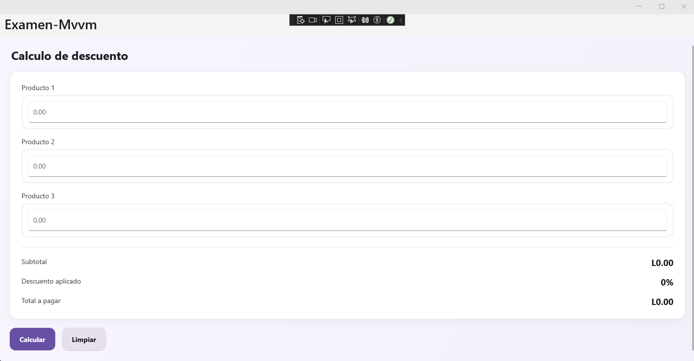
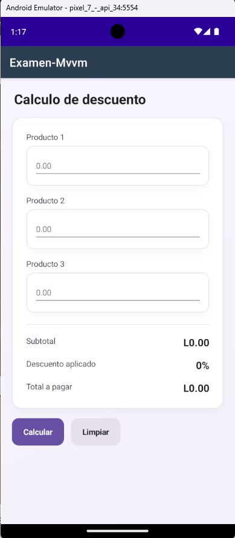

# Examen-MVVM · .NET MAUI (.NET 8)

## Capturas
<p align="center">
  
</p>


<p align="center">
  
</p>


---

## Nota académica
**Este proyecto forma parte del _Examen 2 de Programación II_.**

A continuación se adjunta el **requerimiento oficial** (texto literal del enunciado).

### Requerimiento oficial (adjunto)
> En una despensa se requiere calcular el descuento aplicado a la compra de tres productos. Los descuentos se determinan según el total de la suma de los tres productos, conforme a los siguientes rangos:
>
> **De L0.00 a L999.99:** No aplica descuento.  
> **De L1,000.00 a L4,999.99:** 10% de descuento.  
> **De L5,000.00 a L9,999.99:** 20% de descuento.  
> **De L10,000.00 a L19,999.99:** 30% de descuento.  
> **De L20,000.00 en adelante:** No aplica descuento.
>
> **Requisitos de la Aplicación**  
> Se debe desarrollar una aplicación en .NET MAUI, con el nombre del proyecto: **📁 Examen-Mvvm**
>
> **La aplicación debe cumplir con los siguientes elementos funcionales y de diseño:**
>
> **Entradas de productos**  
> - Tres campos de entrada para los valores de los productos: Producto 1, Producto 2 y Producto 3.  
> - Cada campo debe permitir solo la entrada de números (teclado numérico).
>
> **Campos calculados**  
> - **Subtotal**: suma de los tres productos. Campo de solo lectura.  
> - **Descuento aplicado**: porcentaje correspondiente según el rango. Si no aplica descuento, mostrar 0. Campo de solo lectura.  
> - **Total a pagar**: resultado de restar el descuento al subtotal. Campo de solo lectura.
>
> **Botones**  
> - **Calcular**: al presionarlo, debe realizar todas las operaciones necesarias (cálculo de subtotal, descuento y total a pagar).  
> - **Limpiar**: debe restablecer todos los campos a su estado inicial (vacíos o con valor cero).
>
> **Validaciones y manejo de errores**  
> - Implementar validaciones adecuadas para evitar errores en tiempo de ejecución (por ejemplo, manejar excepciones si el usuario deja campos vacíos o introduce datos inválidos).
>
> **Diseño**  
> - El diseño visual de la aplicación queda a criterio del desarrollador. Se valorará la claridad, legibilidad y usabilidad.
>
> - 
>
> **Repositorio**  
> - El proyecto debe subirse a un repositorio, recuerde que el repositorio debe ser público, adjuntar enlace del mismo.
>
> **Librería a utilizar**  
> - Se debe utilizar la librería: **CommunityToolkit.Mvvm**  
> - Es indispensable aplicar esta librería para implementar el patrón MVVM.
>
> **Criterios de Evaluación**  
> | Criterio | Puntos |  
> |---|---|  
> | Implementación del patrón MVVM | 5% |  
> | Funcionalidad del botón Calcular (incluye lógica en backend) | 5% |  
> | Funcionalidad del botón Limpiar (incluye lógica en backend) | 2% |  
> | Configuración de teclado numérico en cada campo de entrada | 3% |  
> | Inclusión de los 3 campos para los productos | 3% |  
> | Campo de Subtotal (valor correcto, solo lectura) | 2% |  
> | Campo de Descuento (valor correcto según los rangos, solo lectura) | 3% |  
> | Campo de Total a pagar (valor correcto, solo lectura) | 2% |

## Descripción
Aplicación **.NET MAUI (.NET 8)** para calcular el **descuento aplicado a la compra de tres productos** en una despensa, siguiendo rangos definidos. Implementa **MVVM** con **CommunityToolkit.Mvvm** y asegura que las entradas solo permitan números (teclado numérico y un **comportamiento** que filtra la entrada).

---

## Requerimiento (reglas de descuento en Lempiras)
- **L0.00 a L999.99 → 0%**
- **L1,000.00 a L4,999.99 → 10%**
- **L5,000.00 a L9,999.99 → 20%**
- **L10,000.00 a L19,999.99 → 30%**
- **L20,000.00 en adelante → 0%**

---

## Campos y acciones
- **Entradas**: Producto 1, Producto 2, Producto 3 (numéricos).
- **Subtotal** (solo lectura).
- **Descuento aplicado** (porcentaje, solo lectura).
- **Total a pagar** (solo lectura).
- **Botones**: *Calcular* y *Limpiar*.
- **Validaciones**: campos vacíos, formato inválido y negativos.

---

## Tecnologías
- .NET 8
- .NET MAUI
- CommunityToolkit.Mvvm

---

## Requisitos previos
- **Visual Studio 2022** (17.8 o superior) con la **carga de trabajo .NET MAUI**.
- **.NET 8 SDK**.
- Emulador **Android / iOS** o destino **Windows (WinUI)** si estás en Windows.

---

## Cómo ejecutar

### Visual Studio
1. Abrir la solución en **Visual Studio 2022**.
2. Instalar el paquete NuGet: **CommunityToolkit.Mvvm**.
3. Seleccionar destino (**Android, iOS o Windows**).
4. Ejecutar (**F5** o **Ctrl+F5**).

### CLI
```bash
dotnet restore
dotnet build
# Ejecutar (ejemplo Windows/WinUI)
dotnet build -t:Run -f net8.0-windows10.0.19041.0
# Alternativas
# dotnet build -t:Run -f net8.0-android
# dotnet build -t:Run -f net8.0-ios
```
> Para iOS se requiere macOS. En Android, usa un emulador o dispositivo conectado.

---

## Estructura del proyecto
```
Examen-Mvvm/
├─ App.xaml
├─ App.xaml.cs
├─ AppShell.xaml
├─ AppShell.xaml.cs
├─ MainPage.xaml
├─ MainPage.xaml.cs
├─ Comportamientos/
│  └─ ComportamientoEntradaNumerica.cs
├─ ViewModels/
│  └─ MainViewModel.cs
├─ Resources/
├─ Platforms/
└─ (otros archivos MAUI por defecto)
```

---

## Arquitectura (MVVM)
**View: `MainPage.xaml`**
- `Entry` × 3 con teclado numérico + `ComportamientoEntradaNumerica`.
- Labels de **Subtotal**, **Descuento** y **Total** (solo lectura).
- Botones: **Calcular** y **Limpiar**.
- `BindingContext` al `MainViewModel` (en XAML).

**ViewModel: `MainViewModel.cs`**
- Entradas como `string`, resultados `decimal`/`int`.
- `[RelayCommand]` para `Calcular` y `Limpiar`.

**Comportamiento: `ComportamientoEntradaNumerica.cs`**
- Restringe a dígitos y un separador decimal (según cultura).
- Soporta pegado y limpia caracteres inválidos.

---

## Lógica de descuento
- [0.00, 999.99] → 0%
- [1,000.00, 4,999.99] → 10%
- [5,000.00, 9,999.99] → 20%
- [10,000.00, 19,999.99] → 30%
- ≥ 20,000.00 → 0%

**Total = Subtotal - (Subtotal × Descuento / 100)**

---

## Casos de prueba manuales
| P1, P2, P3 | Subtotal | % | Total |
|---|---:|---:|---:|
| 0, 0, 0 | 0.00 | 0% | 0.00 |
| 100, 200, 300 | 600.00 | 0% | 600.00 |
| 400, 300, 300 | 1,000.00 | 10% | 900.00 |
| 2,000, 2,000, 800 | 4,800.00 | 10% | 4,320.00 |
| 2,500, 2,500, 500 | 5,500.00 | 20% | 4,400.00 |
| 3,500, 3,500, 3,000 | 10,000.00 | 30% | 7,000.00 |
| 10,000, 5,000, 5,000 | 20,000.00 | 0% | 20,000.00 |

---

## Instalación del paquete MVVM
```bash
dotnet add package CommunityToolkit.Mvvm
```

---

## Licencia
Proyecto educativo.
